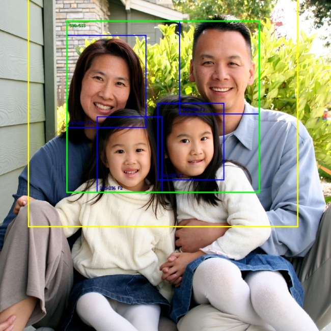
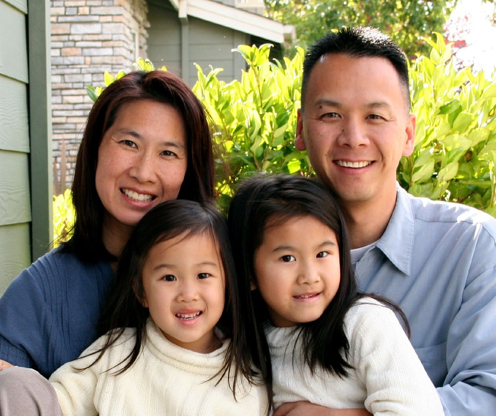

# Thumbla: A Versatile Image Processing Microservice

Created by Eran Sandler ([@erans](https://twitter.com/erans)) | http://eran.sandler.co.il | &copy; 2018


Thumbla is a powerful microservice for image processing and manipulation. It provides secure access to images stored in private locations like cloud storage buckets, along with extensive image transformation capabilities.


## DockerHub
You can pull the latest Docker image from [DockerHub](https://hub.docker.com/r/erans/thumbla):
```
docker pull erans/thumbla:latest
```

## Input Image Format Support:
- **JPEG/JPG** - Standard compressed image format
- **PNG** - Lossless image format with transparency
- **WEBP** - Modern efficient image format
- **GIF** - Supports reading single frames
- **SVG** - Vector graphics format

## Output Image Format Support:
- **JPEG/JPG** - Optimized lossy compression
- **PNG** - High quality with alpha channel
- **WEBP** - Next-gen image format

### SVG Processing
SVG files are vector-based graphics that can be scaled to any dimensions. Since Thumbla needs to apply image manipulations, SVG files must first be rasterized (converted to PNG format).

To control the rasterization size, append dimensions to the SVG URL using this syntax:
`https://example.com/i/pics/subpath_inside_bucket%2Fmyfile.svg|{W},{H}/output:f=jpg`

The parameters `{W}` and `{H}` specify the width and height in pixels for the rasterized output. For proportional scaling, use -1 for the dimension you want automatically calculated. For example:

`https://example.com/i/pics/subpath_inside_bucket%2Fmyfile.svg|300,-1/output:f=jpg`

This will rasterize the SVG at 300 pixels wide while maintaining the original aspect ratio.

If no dimensions are specified, Thumbla will use the SVG's default size, which is typically quite small.

## Supported Fetchers:
- **Local** - fetch from a local directory on the server (the directory can also be mounted from a remote location and shared across servers)
- **HTTP/S** - fetch from a remote HTTP/S server
- **[AWS S3](https://aws.amazon.com/s3/)** - fetch from an S3 bucket. Supports accessing a private S3 bucket that is not accessible to the world.
- **[Google Storage](https://cloud.google.com/storage/)** - fetch from a Google Storage bucket. Support accessing a private Google Storage bucket that is not accessible to the world.
- **[Azure Blob Storage](https://azure.microsoft.com/en-us/services/storage/blobs/)** - fetch from an Azure Blob Storage bucket. Support accessing a private Azure Blob Storage bucket that is not accessible to the world.
- **[DigitalOcean Spaces](https://www.digitalocean.com/products/spaces/)** - fetch from a DigitalOcean Spaces bucket. Support accessing a private DigitalOcean Spaces bucket that is not accessible to the world.
- **[Cloudflare R2](https://www.cloudflare.com/r2/)** - fetch from a Cloudflare R2 bucket. Support accessing a private Cloudflare R2 bucket that is not accessible to the world.

With AWS S3 and Google Storage support you can allow access to only a specific folder within a private bucket.

### Fetchers Configuration
- **Local** - fetches files from a locally accessible folder on the server
  - **path** - the path to the location where images resize. This path will serve as the root path and all images will be referenced relative to it. This path can also be remotely mounted and acecssed by multiple servers as Thumbla only needs read access.


- **HTTP/S** - fetches files from HTTP/S URLs
  - **userName** - use if the HTTP URL requires a username
  - **password** - use if the HTTP URL requires a password
  - **secure** - fetch only from HTTPS sources
  - **restrictHosts** - an array of restricted hostname this instance of the fetcher will retrieve images from. For example, if the restrictHosts is set to `images.example.com` only URLs that has this hostname will be fetches, others will be rejected.
  - **restrictPaths** - an array of restricted paths that this instance of the fetcher will retrieve image from from. For example, if  the restrictPaths is set to `/img/` only URLs with that path will be fetched, others will be rejected.

  - **restrictHosts** and **restrictPaths** can be combined to restrict a certain host and a certain path, for example.


- **AWS S3** - fetches files from an AWS S3 bucket
  - **region** - the AWS S3 bucket region
  - **accessKeyID** - the access Key ID to access this bucket. Not needed if you are using IAM roles
  - **secretAccessKey** - the access key secret. Not needed if you are using IAM roles

  - To fetch from S3 buckets use URLs in the format of:
  `http://s3-aws-region.amazonaws.com/bucket/path/file`


- **Google Storage** - fetches files from a Google Storage bucket
  - **bucket** - bucket Name
  - **path** - will be used as a root path. If set you can use relataive paths when fetching images to manipulate
  - **projectId** - the project ID that is associated with that Google Storage bucket
  - **securitySource** - can be `background` if the machine running Thumbla has access to that (or all buckets), otherwise set to `file`
  - **serviceAccountJSONFile** - a path to the service account JSON file that will allow access to the specified bucket. Only needed when *securitySource* is set to `file`

- **Azure Blob Storage** - fetches files from an Azure Blob Storage bucket
  - **accountName** - the Azure Blob Storage account name
  - **accountKey** - the Azure Blob Storage account key

- **DigitalOcean Spaces** - fetches files from a DigitalOcean Spaces bucket
  - **accessID** - the DigitalOcean Spaces access ID
  - **secretKey** - the DigitalOcean Spaces secret key

- **Cloudflare R2** - fetches files from a Cloudflare R2 bucket
  - **accessKey** - the Cloudflare R2 access key
  - **secretKey** - the Cloudflare R2 secret key

## Supported Manipulators
Fetched images can then be manipulated via manipulators such as:
- **Resize** - resize the image proportionally or not
- **Fit** - fit the image to a specified size proportionally
- **Crop** - crop parts of the images
- **Flip Horizontally** - flips the image horizontally
- **Flip Vertically** - flips the image vertically
- **Rotate** - rotate the image. resize the image to include the complete rotated original image
- **Shear Horizontally**
- **Shear Vertically**
- **Face Crop**
- **Paste** - allows pasting (preferably PNG) images (initial support)
- **brightness** - adjust the brightness of the image
- **contrast** - adjust the contrast of the image

## Face Cropping
The face crop manipulator automatically detects and focuses on faces in images while preserving the original aspect ratio. Since faces naturally draw human attention more than other image elements, this feature excels at creating engaging thumbnails and focused images that highlight the people in your photos.

The following facial detection services are supported:
  - [AWS Rekognition](https://aws.amazon.com/rekognition/)
  - [Google Vision API](https://cloud.google.com/vision/) (facial detection capabilities)
  - [Azure Face API](https://azure.microsoft.com/en-us/services/cognitive-services/face/)

Below is a demonstration of the face cropping process. The blue rectangles indicate detected faces, while the yellow rectangle shows the final crop area:<br/>



After cropping, the final image looks like this:<br/>


## Configuration Guide
For a complete configuration example, refer to [`config-example.yml`](config-example.yml).

The configuration file consists of two main components:
- `fetchers` - Defines the image source configurations. This section contains all required parameters for accessing different image sources, such as cloud storage credentials and HTTP/S access restrictions.

- `paths` - Specifies which URL paths are available on the server. You can configure multiple paths and map them to different fetchers, enabling a single server to retrieve images from various cloud services. All paths must end with a forward slash (`/`) since Thumbla appends additional URL segments for request processing.

## URL Structure
The URL structure follows a pattern that combines the configured path, source file location, and any image manipulations. Here's how it works:

For a basic image request with a configured path `/i/pics/` using an AWS S3 fetcher:
`https://example.com/i/pics/path%2Fto%2Fimage.jpg/output:f=jpg`

The middle segment contains the URL-encoded path to your image within the bucket. For example, `path%2Fto%2Fimage.jpg` represents `path/to/image.jpg`. When using an HTTP fetcher, this can be a complete URL (as long as it's properly encoded).

To apply image manipulations, add them as additional path segments:

Single manipulation (resize to 350px width):
`https://example.com/i/pics/path%2Fto%2Fimage.jpg/resize:w=350/output:f=jpg`

Multiple manipulations (rotate then resize):
`https://example.com/i/pics/path%2Fto%2Fimage.jpg/rotate:a=35/resize:w=350/output:f=jpg`

In the last example, the image is first rotated 35 degrees, then resized to 350px width while maintaining the aspect ratio. Manipulators are applied in the order they appear in the URL.

## Running Under Kubernetes
- The best way to run the mico service under Kubernetes with custom configuration is to update the configuration file as a configmap:
```
kubectl create configmap thumbla-config --from-file=thumbla.yml
```

You can then mount `thumbla-config` as a volume inside your container and point to it using an environment varaible `THUMBLACFG`. For example:
```
apiVersion: v1
kind: ReplicationController
metadata:
  name: thumbla
spec:
  replicas: 1
  template:
    metadata:
      labels:
        app: thumbla
    spec:
      containers:
      - name: thumbla
        image: erans/thumbla:latest
        volumeMounts:
        -
          name: config-volume
          mountPath: /etc/config
        env:
          -
            name: THUMBLACFG
            value: "/etc/config/thumbla.yml"
          -
            name: PORT
            value: "8000"
        ports:
        - containerPort: 8000

      volumes:
        - name: config-volume
          configMap:
            name: thumbla-config
```

The above configuration will mount `thumbla-config` map onto `/etc/config` inside the container. The environment variable `THUMBLACFG` points to the config file `thumbla.yml` under `/etc/config` (the mounted volume).


## What's still missing:
- various images enhancements
- Recipes - store complex image manipulation recipes and only pass input parameters

